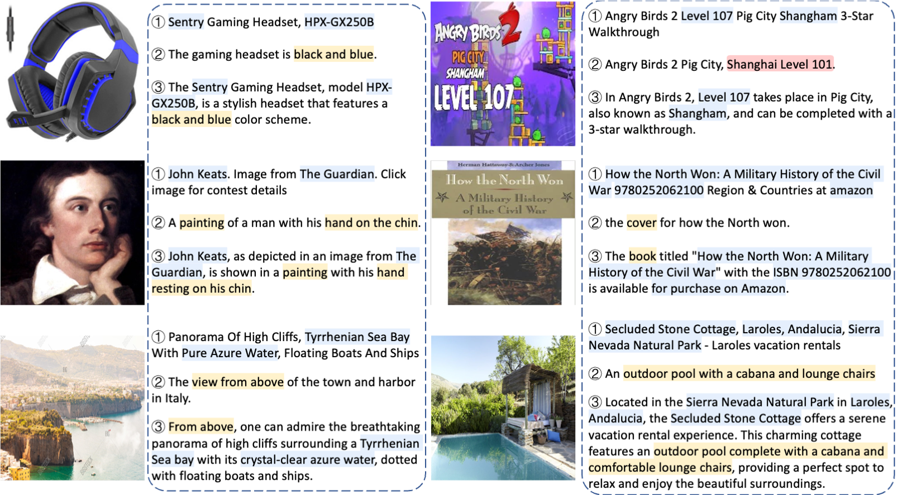
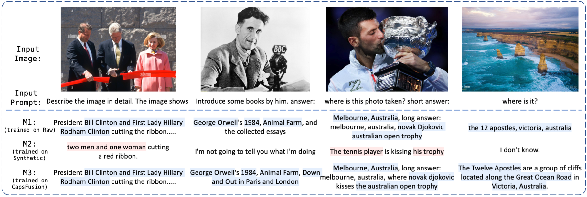

<div align='center'>
<h1><a href="https://arxiv.org/abs/2310.20550">CapsFusion: Rethinking Image-Text Data at Scale</a></h1>
[Qiying Yu](https://yqy2001.github.io)<sup>1,2*</sup>, [Quan Sun](https://github.com/Quan-Sun)<sup>2*</sup>, [Xiaosong Zhang](https://github.com/zhangxiaosong18)<sup>2</sup>, [Yufeng Cui](https://scholar.google.com/citations?user=5Ydha2EAAAAJ&hl=en&oi=ao)<sup>2</sup>, [Fan Zhang](https://scholar.google.com/citations?user=VsJ39HMAAAAJ)<sup>2</sup><br>[Yue Cao](http://yue-cao.me)<sup>3</sup>, [Xinlong Wang](https://www.xloong.wang/)<sup>2</sup>, [Jingjing Liu](https://air.tsinghua.edu.cn/en/info/1046/1194.htm)<sup>1</sup>

<sup>1</sup> [Tsinghua, AIR](https://air.tsinghua.edu.cn/en/), <sup>2</sup> [BAAI](https://www.baai.ac.cn/english.html), <sup>3</sup> [Independent Researcher](http://yue-cao.me)<br><sup>*</sup> Equal Contribution
</div>

CapsFusion is a straightforward and scalable framework for generating high-quality captions for image-text pairs. This framework leverages large language models (LLMs) to organically incorporate the strengths of both real image-text pairs and synthetic captions generated by captioning models, to address the severe *Scalability Deficiency* and *World Knowledge Loss* issues in large multimodal models (LMMs) trained with synthetic captions.

## 🚀 News

* `Mon 9, 2023`: Release the CapsFusion 120M caption data.
* `Nov 29, 2023`: Release the model and distributed inference code of CapsFus-LLaMA.

## Data

We release the CapsFusion-120M dataset, a high-quality resource for large-scale multimodal pretraining. This release includes corresponding captions from the LAION-2B and LAION-COCO datasets, facilitating comparative analyses and further in-depth investigations into the quality of image-text data.

The dataset can be downloaded from [🤗Huggingface](https://huggingface.co/datasets/BAAI/CapsFusion-120M/tree/main). Each data entry has four fields:

* Image URL
* LAION-2B caption (raw alt-text from the web)
* LAION-COCO caption (synthesized by BLIP)
* CapsFusion caption (ours)

We provide a code snippet to illustrate the process of extracting caption data from the given parquet files, which prints the `url`, `laion_2b`, `laion_coco` and `capsfusion` captions for the first three entries:

```python
import pandas as pd
data = pd.read_parquet("capsfusion_1.parquet")
for idx, item in d.iterrows():
    print(f"{item['image_url']=}")
    print(f"{item['laion_2b']=}")
    print(f"{item['laion_coco']=}")
    print(f"{item['capsfusion']=}")
    print('\n')
    
    if idx == 2:
        break
```

Please note that due to our inability to pair all captions with their corresponding image URLs, the number of captions released totals 113 million. However, we anticipate that the performance achieved with this dataset will be comparable to that of training on the entire 120 million captions.

## Model Usage

We provide instructions below for employing the CapsFus-LLaMA model to generate CapsFusion captions given raw captions from LAION-2B and synthetic captions from LAION-COCO.

### Installation

```sh
pip install -r requirements.txt
```

### Data format

We provide 10,000 samples in `./data/example_data.json`. You can organize your own data in a similar structure. Each sample has the following structure, containing captions from LAION-2B and LAION-COCO:
```json
{
  "laion_2b": ..., 
  "laion_coco": ..., 
}
```
We also attached a `capsfusion_official` item for each sample in `./data/example_data.json`, which is the CapsFusion caption generated by CapsFus-LLaMA.

### Inference

```sh
torchrun --nnodes 1 --nproc_per_node 8 capsfusion_inference.py
```

It takes about 20 minutes to refine the 10,000 samples with 8 A100-40G GPUs. You can change the value of `nnodes` and `nproc_per_node` according to your available GPUs.

The CapsFus-LLaMA model will be automatically downloaded from huggingface. You can alternatively also manually download the model from this huggingface [model repo](https://huggingface.co/BAAI/CapsFus-LLaMA/tree/main), and change the `model_name` in `config.yaml` to your local model directory path.

The result files will be saved at `./data`.

## Examples

Examples generated by CapsFusion are provided below: ➀ real web-based captions (from LAION-2B, which are noisy), ➁ synthetic captions (from LAION-COCO, generated by BLIP, which are syntactically and semantically simplistic), and their corresponding ③ CapsFusion captions. 

Knowledge from raw captions (in blue) and information from synthetic captions (in yellow) are organically fused into integral CapsFusion captions. More captions and detailed analysis can be found in our [paper](https://arxiv.org/abs/2310.20550).



Models trained on CapsFusion captions exhibit a wealth of real-world knowledge (shown in the figure below), meanwhile outperforming both real and synthetic captions in benchmark evaluations (details can be found in the [paper](https://arxiv.org/abs/2310.20550)).



## Plan

Please stay tuned for upcoming releases. Thank you for your understanding.

- [x] CapsFus-LLaMA model with distributed inference code

- [ ] CapsFusion-10M subset: Images with Raw (from LAION-2B), Synthetic (from LAION-COCO), and CapsFusion captions

- [x] CapsFusion-120M fullset: Image URLs with CapsFusion captions

## Reference

CapsFusion: Rethinking Image-Text Pairs at Scale -- https://arxiv.org/abs/2310.20550

```
@article{yu2023capsfusion,
  title={CapsFusion: Rethinking Image-Text Data at Scale},
  author={Yu, Qiying and Sun, Quan and Zhang, Xiaosong and Cui, Yufeng and Zhang, Fan and Cao, Yue and Wang, Xinlong and Liu, Jingjing},
  journal={arXiv preprint arXiv:2310.20550},
  year={2023}
}
```

## Acknowledgement

Partial code adapted from [Alpaca](https://github.com/tatsu-lab/stanford_alpaca), [FastChat](https://github.com/lm-sys/FastChat). Thanks for their great work.